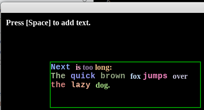

# Experiment 8 - Styled Text

This is an attempt to create a simple text window that supports some text
styling (multiple fonts and colours). Print text to it, render it, and scroll
up when you reach the bottom.



You can run it from this directory with:

```sh
./love .
```

If you're using Sublime Text:

1. Open the project.
1. Under Tools -> Build System, choose "Launch Löve2D". You only need to pick
   the build system once, it's stored in the workspace file.
1. Choose Tools -> Build or press its shortcut (Ctrl+B).

Press Escape to exit the demo.

## Credits

This is written in Lua, using the [LÖVE](https://love2d.org/) 2D game engine. I
didn't know about that until I stumbled on [CS50's Introduction to Game
Development](https://www.edx.org/course/cs50s-introduction-to-game-development).

Check the `.lua` file headers for individual credits; stuff I wrote is released
under the [MIT license](LICENSE.md).

### Graphics

* `LiberationMono-Bold.ttf` and `LiberationSerif-Bold.ttf` - Open source fonts
  from the
  [liberationfonts](https://github.com/liberationfonts/liberation-fonts) repo;
  this is licensed under the
  [SIL Open Font License](https://github.com/liberationfonts/liberation-fonts/blob/master/LICENSE).

### Libraries

* [middleclass](https://github.com/kikito/middleclass) by Enrique García Cota
