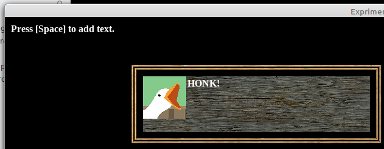

# Experiment 6 - UI Dialog

In this experiment, we'll draw a dialog box with some text in it and a
character portrait.



You can run it from this directory with:

```sh
./love .
```

If you're using Sublime Text:

1. Open the project.
1. Under Tools -> Build System, choose "Launch Löve2D". You only need to pick
   the build system once, it's stored in the workspace file.
1. Choose Tools -> Build or press its shortcut (Ctrl+B).

Press Escape to exit the demo.

## Credits

This is written in Lua, using the [LÖVE](https://love2d.org/) 2D game engine. I
didn't know about that until I stumbled on [CS50's Introduction to Game
Development](https://www.edx.org/course/cs50s-introduction-to-game-development).

Check the `.lua` file headers for individual credits; stuff I wrote is released
under the [MIT license](LICENSE.md).

### Graphics

* `HONK.png` - The Goose from House House's amazing
  [Untitled Goose Game](https://goose.game/), used without permission. I'm not
  affiliated with House House in any way, other than as a happy customer. You
  should buy Untitled Goose Game, it's *amazingly fun*. I have it on my Switch!
* `rpg_gui_v1` -
  [RPG GUI construction kit v1.0](https://opengameart.org/content/rpg-gui-construction-kit-v10)
  by Lamoot on OpenGameArt.org.

Font:

* `LiberationSerif-Bold.ttf` - An open source font from the
  [liberationfonts](https://github.com/liberationfonts/liberation-fonts) repo;
  this is licensed under the
  [SIL Open Font License](https://github.com/liberationfonts/liberation-fonts/blob/master/LICENSE).
